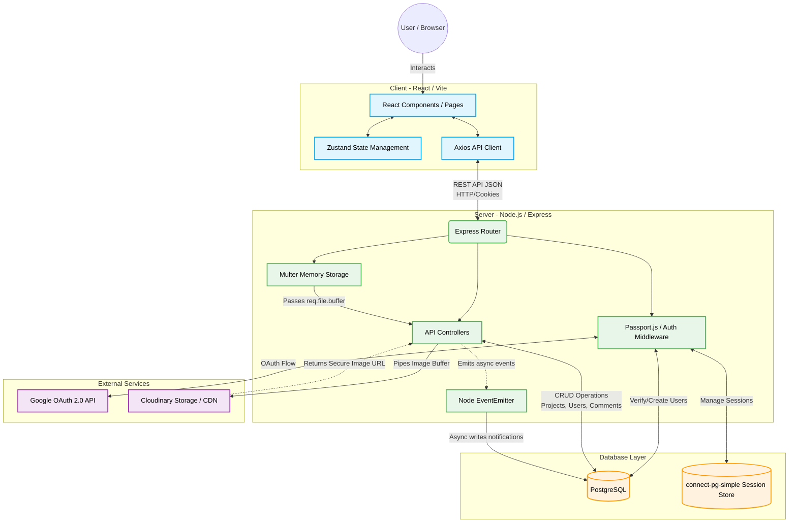

# UOK Connect

A student project showcase portal for the University of Kelaniya — Faculty of Computing.
Students can publish their projects, companies can discover talent, and admins can moderate content.

---

## Architecture



---

### Architecture Breakdown

1. **Frontend (Client)**
   - Built with **React 18** and **Vite**.
   - Uses **Zustand** for centralized, lightweight state management (e.g., authentication context).
   - Uses **Axios** to communicate with the backend, automatically sending `HTTP-only` cookies for session/authentication management.

2. **Backend (Server)**
   - A **Node.js** and **Express 5** application.
   - **Passport.js** manages the authentication flow with Google OAuth.
   - **Multer** acts as middleware to intercept file uploads, storing them temporarily in memory.
   - The **EventEmitter** asynchronously handles events (like a user registering or a project being liked) and writes them to the notifications table without blocking the main request/response cycle.

3. **Database**
   - **PostgreSQL**: Stores all application data (`users`, `projects`, `comments`, `likes`, `notifications`).
   - Also utilized by `connect-pg-simple` to securely store and manage Express session data.

4. **External Services**
   - **Google OAuth 2.0**: Handles the Single Sign-On (SSO) login flow.
   - **Cloudinary**: Directly receives image streams from the backend memory, hosts the images, and acts as a CDN, returning a secure URL to the backend to store in the database.

---

## Tech Stack

| Layer | Technology |
|-------|-----------|
| Frontend | React 18 + Vite, Tailwind CSS v4, Framer Motion |
| Backend | Node.js + Express 5 |
| Database | PostgreSQL |
| Auth | Google OAuth 2.0 (Passport.js) + JWT (HTTP-only cookies) |
| Storage | Cloudinary (image uploads) |
| State | Zustand |
| Forms | React Hook Form + Zod |

---

## Project Structure

```
Student_Project_Portal/
├── client/                   React frontend (Vite)
│   ├── src/
│   │   ├── components/       Navbar, Footer, ProjectCard, ProtectedRoute
│   │   ├── pages/            All page components
│   │   ├── services/         Axios API client
│   │   ├── store/            Zustand auth store
│   │   └── index.css         Tailwind + global styles
│   ├── .env.example
│   └── vite.config.js
│
├── server/                   Express backend
│   ├── src/
│   │   ├── app.js            Entry point
│   │   ├── config/           DB, Cloudinary, Passport config
│   │   ├── controllers/      Auth, Projects, Users, Notifications
│   │   ├── events/           EventEmitter + notification handlers
│   │   ├── middleware/        Auth JWT, validation, file upload
│   │   ├── routes/           API routes
│   │   └── utils/            JWT helpers
│   ├── scripts/
│   │   └── setupDb.js        Database initialisation script
│   └── .env.example
│
└── docs/                     Requirements and DB schema
```

---

## Prerequisites

- Node.js v18+
- PostgreSQL 14+
- A Google Cloud project with OAuth 2.0 credentials
- A Cloudinary account (free tier works)

---

## Setup Guide

### 1. Clone & install dependencies

```bash
# Install server dependencies
cd server
npm install

# Install client dependencies
cd ../client
npm install
```

### 2. Configure environment variables

#### Server
```bash
cp server/.env.example server/.env
# Edit server/.env with your values
```

Required values in `server/.env`:
- `DB_*` — PostgreSQL connection details
- `SESSION_SECRET` — long random string (32+ chars)
- `JWT_SECRET` — long random string (32+ chars)
- `GOOGLE_CLIENT_ID` / `GOOGLE_CLIENT_SECRET` — from Google Cloud Console
- `ADMIN_SECRET_KEY` — secret required to create admin accounts
- `CLOUDINARY_*` — from your Cloudinary dashboard

#### Client
```bash
cp client/.env.example client/.env
# Edit VITE_API_URL if your backend runs on a different port
```

### 3. Set up Google OAuth

1. Go to [Google Cloud Console](https://console.cloud.google.com/)
2. Create a new project (or use existing)
3. Enable the **Google+ API** / **People API**
4. Go to **Credentials → Create Credentials → OAuth 2.0 Client ID**
5. Application type: **Web application**
6. Add Authorised Redirect URIs:
   - `http://localhost:5001/api/auth/google/callback` (development)
   - `http://localhost:5001/api/auth/admin/google/callback` (admin)
7. Copy Client ID and Secret into `server/.env`

### 4. Create the database

```bash
# Create the PostgreSQL database
psql -U postgres -c "CREATE DATABASE uok_connect;"

# Run the setup script
cd server
npm run db:setup
```

### 5. Run the development servers

```bash
# Terminal 1 — Backend (port 5001)
cd server
npm run dev

# Terminal 2 — Frontend (port 5173)
cd client
npm run dev
```

Open [http://localhost:5173](http://localhost:5173) in your browser.

---

## User Roles

| Role | How to Create | Capabilities |
|------|--------------|--------------|
| **Student** | Google OAuth via `/auth/login` → Student option | Add/edit/delete own projects, like, follow, notifications |
| **Recruiter** | Google OAuth via `/auth/login` → Company option | Browse projects (public), like projects, follow students |
| **Admin** | Visit `/admin/auth`, enter secret key, then Google OAuth | All of the above + delete any project, view all users |

> **Note:** The admin portal at `/admin/auth` is not linked from the public navigation — it is a hidden route.

---

## API Reference

### Auth
| Method | Endpoint | Description |
|--------|----------|-------------|
| GET | `/api/auth/google/student` | Initiate student Google OAuth |
| GET | `/api/auth/google/recruiter` | Initiate recruiter Google OAuth |
| GET | `/api/auth/google/callback` | Google OAuth callback |
| POST | `/api/auth/admin/verify-key` | Validate admin secret key |
| GET | `/api/auth/admin/google` | Initiate admin Google OAuth |
| POST | `/api/auth/logout` | Logout (clears cookie) |
| GET | `/api/auth/me` | Get current user |
| POST | `/api/auth/complete-profile` | Set student ID after OAuth |

### Projects
| Method | Endpoint | Auth Required | Description |
|--------|----------|--------------|-------------|
| GET | `/api/projects` | No | List all published projects |
| GET | `/api/projects/:id` | No | Get single project |
| POST | `/api/projects` | Student | Create project |
| PUT | `/api/projects/:id` | Student/Admin | Update project |
| DELETE | `/api/projects/:id` | Student/Admin | Delete project |
| POST | `/api/projects/:id/like` | Any auth | Toggle like |

### Users
| Method | Endpoint | Auth Required | Description |
|--------|----------|--------------|-------------|
| GET | `/api/users` | Admin | List all users |
| GET | `/api/users/:id` | No | Get user profile |
| GET | `/api/users/:id/projects` | No | Get user's projects |
| POST | `/api/users/:id/follow` | Any auth | Toggle follow |

### Notifications
| Method | Endpoint | Auth Required | Description |
|--------|----------|--------------|-------------|
| GET | `/api/notifications` | Yes | Get my notifications |
| PATCH | `/api/notifications/:id/read` | Yes | Mark one as read |
| PATCH | `/api/notifications/read-all` | Yes | Mark all as read |

---

## Security Notes

- JWT tokens are stored in **HTTP-only cookies** — not accessible to JavaScript
- Admin accounts require a **secret key** before Google OAuth
- Rate limiting is applied to all API routes (100 req/15 min) and stricter for auth (20 req/15 min)
- Helmet.js sets security headers
- Input validation via `express-validator` and Zod (frontend)
- CORS configured to only allow the frontend origin

---

## Deployment

### Frontend → Vercel / Netlify
```bash
cd client
npm run build
# Deploy the dist/ folder
```

Set environment variable `VITE_API_URL` to your production API URL.

### Backend → Render / Railway
Set all `.env` variables in the platform's environment settings.

### Database → Neon / Supabase PostgreSQL
Use the connection string provided and run `npm run db:setup`.
